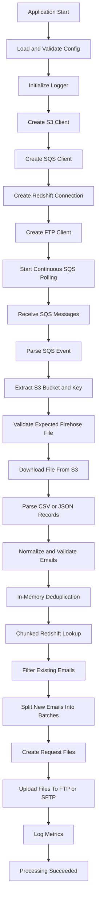

# GPD Email Processing Flow

This document describes the runtime flow currently implemented in this project.

## High-Level Flow

## Startup Sequence

The application starts in [cmd/main.go](cmd/main.go).

1. Load configuration from environment variables using [config/config.go](config/config.go).
2. Validate that all required values are present.
3. Initialize logging via [logger/logger.go](logger/logger.go).
4. Create the S3 client via [aws/s3utils.go](aws/s3utils.go).
5. Create the SQS client via [aws/sqsutils.go](aws/sqsutils.go).
6. Create the Redshift connection abstraction via [database/redshift.go](database/redshift.go).
7. Create the FTP client config and client via [ftp/ftp.go](ftp/ftp.go).
8. Create the email processor and start continuous polling via [processor/emailprocessor.go](processor/emailprocessor.go).

## Message Processing Flow

The main processing loop is in [processor/emailprocessor.go](processor/emailprocessor.go).

### 1. Poll SQS Continuously

The processor continuously long-polls the configured SQS queue.

- Uses `MaxNumberOfMessages` from config.
- Uses `WaitTimeSeconds` from config.
- Handles one or more messages per poll.
- Deletes the SQS message only after the full success path completes.

### 2. Parse and Validate the SQS Message

The SQS message body is parsed in [email/parser.go](email/parser.go).

This step:

- unwraps an SNS-style `Message` envelope if present
- parses the S3 event payload
- extracts the S3 bucket name
- extracts the S3 object key
- decodes the key if needed
- validates the file against the configured expected bucket, prefix, and extension

If this step fails, the message is treated as a malformed SQS message.

### 3. Download the Firehose Output File From S3

The processor calls the S3 client in [aws/s3utils.go](aws/s3utils.go) to download the object as a stream.

This step currently uses the `GetObject` abstraction and is retried on failure.

### 4. Parse Records and Extract Emails

The S3 payload is parsed in [email/parser.go](email/parser.go).

Supported formats:

- CSV
- JSON array
- NDJSON

For every record, the parser:

- reads the `email` field
- normalizes it using trim + lowercase
- validates the email format
- rejects empty or invalid values
- tracks extraction metrics:
  - total records
  - invalid records

If parsing fails at the file level, the input is treated as a corrupted input file.

### 5. Deduplicate Within the Same Firehose File

In-memory deduplication is handled in [email/dedup.go](email/dedup.go).

- Uses a Go map as a set.
- Preserves first-seen order.
- Removes duplicates within the same batch only.

### 6. Check Existing Emails in Redshift

The processor uses [database/redshift.go](database/redshift.go) to look up already-known emails.

Behavior:

- splits unique emails into configured chunks
- builds batched `IN (...)` lookup queries against `EmailUnique`
- normalizes Redshift results into a lookup set
- avoids one query per email

This step is retried on failure.

### 7. Filter Already-Existing Emails

Filtering is handled in [email/filter.go](email/filter.go).

- Emails returned by Redshift are removed.
- Only new emails move to the request-generation stage.

### 8. Split New Emails Into Verification Batches

Batch splitting is implemented in [email/batch.go](email/batch.go).

- Uses the configured batch size.
- Avoids generating one large request payload.
- Produces one or more logical Email Verification Request batches.

### 9. Create Request Files

Request files are created in [email/batch.go](email/batch.go).

Behavior:

- writes one file per verification batch
- supports CSV and JSON output
- generates collision-resistant filenames using:
  - UTC timestamp
  - in-process sequence number
  - random suffix
- writes through a temp file and atomic rename

This step is retried on failure.

### 10. Upload Request Files to FTP or SFTP

Uploads are handled in [ftp/ftp.go](ftp/ftp.go).

Behavior:

- computes the remote target from configured `RemotePath`
- uploads each generated file
- returns uploaded remote paths

This step is retried on failure.

### 11. Success Criteria

A message is considered successfully processed only when:

- the SQS message is valid
- the S3 file is downloaded
- the input file is parsed
- dedup and Redshift filtering complete
- all required request files are created
- all required request files are uploaded
- the SQS message is deleted successfully

If there are no new emails, the message completes successfully without creating or uploading files.
The success path still deletes the SQS message so it does not reappear after a no-op run.

## Failure Handling and Retries

Failure handling is categorized in [processor/emailprocessor.go](processor/emailprocessor.go).

### Failure Categories

- SQS receive failure
- SQS delete failure
- malformed SQS message
- S3 download failure
- corrupted input file
- Redshift connection/query failure
- file-generation failure
- FTP connection/upload failure

### Retry Behavior

Retried:

- SQS receive
- SQS delete
- S3 download
- Redshift lookup
- file generation
- FTP upload

Not retried:

- malformed SQS message
- corrupted input file

## Processing Metrics Logged

Per processed S3 file, the processor logs:

- S3 file processed
- Total records
- Invalid records
- Duplicate records removed
- Unique emails
- Emails already in Redshift
- New emails
- Number of request batches created
- Emails submitted
- FTP files uploaded
- Processing duration

## Module Responsibilities

- [cmd/main.go](cmd/main.go)
  - startup orchestration
- [config/config.go](config/config.go)
  - environment loading and validation
- [logger/logger.go](logger/logger.go)
  - logger initialization
- [aws/sqsutils.go](aws/sqsutils.go)
  - SQS receive abstraction
- [aws/s3utils.go](aws/s3utils.go)
  - S3 get-object abstraction
- [database/redshift.go](database/redshift.go)
  - Redshift batched existence lookup
- [email/parser.go](email/parser.go)
  - SQS event parsing and file parsing
- [email/dedup.go](email/dedup.go)
  - in-memory deduplication
- [email/filter.go](email/filter.go)
  - filtering already-known emails
- [email/batch.go](email/batch.go)
  - logical batching and request-file generation
- [ftp/ftp.go](ftp/ftp.go)
  - FTP/SFTP upload abstraction
- [processor/emailprocessor.go](processor/emailprocessor.go)
  - end-to-end processing flow, retries, and metrics

## Current Integration Status

The application flow is implemented, but external services are still abstracted behind injectable functions.

Current abstractions:

- SQS uses an injectable receiver.
- S3 uses an injectable getter.
- Redshift uses an injectable query function.
- FTP uses an injectable uploader.

That means the orchestration and control flow are complete, but production integration still requires wiring real implementations for:

- AWS SQS
- AWS S3
- Redshift SQL access
- FTP/SFTP transport
